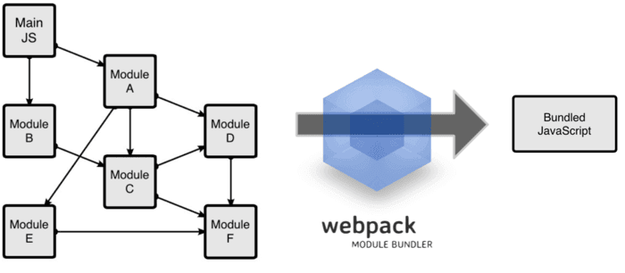

# webpack

## 为什么使用webpack

随着互联网的日益发展现在的网页越来越像是一个功能丰富的应用，其中包含了大量的js代码和各种各样相互依赖的包。为了能够简化开发的复杂度，前端社区里涌现出很多的实践方法。

* 模块化，将复杂的程序细化成为小的文件
* 类似于TypeScript这种在js基础上扩展出来的语言：使我们能够实现目前版本的JavaScript不能直接使用的特性，并且之后还能转换为JavaScript文件使浏览器可以识别；
* sass less 等css的预编译器
* 模块化的概念请参考[webpack module](https://www.webpackjs.com/concepts/modules/)
  这些额外的改进确实大大的提高了我们的开发效率，但是利用他们开发的文件往往需要额外的配置才能被浏览器所能够识别，而手动处理有十分的繁琐，于是就出现了类似于webpack之类的工具。

## 什么是webpack

webpack可以看做是一个**模块打包机**，它做的事情是：分析你项目结构，找到javascript模块和其他浏览器不能够识别的语言(scss less),并将其转换和打包为合适的格式供浏览器使用。

## webpack的工作模式

webpack的工作方式是：把你的项目当做是一个整体，通过一个给定的主文件(index.js)，从这个文件开始找到你项目的所有依赖文件，使用loaders处理他们，最后打包为一个或者多个浏览器能够识别的文件。webpack想比较于其他的前端自动化处理工具速度更快处理的文件类型更多。


## 核心概念(4)

* 入口(entry)
* 出口(output)
* loader
* 插件(plugins)

### 入口
入口起点(entry point)指示 webpack 应该使用哪个模块，来作为构建其内部依赖图的开始。进入入口起点后，webpack 会找出有哪些模块和库是入口起点（直接和间接）依赖的。每个依赖项随即被处理，最后输出到称之为 bundles 的文件中。

### 出口
output 属性告诉 webpack 在哪里输出它所创建的 bundles，以及如何命名这些文件。你可以通过在配置中指定一个 output 字段，来配置这些处理过程

### loader
loader 让 webpack 能够去处理那些非 JavaScript 文件（webpack 自身只理解 JavaScript）。loader 可以将所有类型的文件转换为 webpack 能够处理的有效模块，然后你就可以利用 webpack 的打包能力，对它们进行处理。

本质上，webpack loader 将所有类型的文件，转换为应用程序的依赖图（和最终的 bundle）可以直接引用的模块。

在更高层面，在 webpack 的配置中 loader 有两个目标：

1. test 属性，用于标识出应该被对应的 loader 进行转换的某个或某些文件。
2. use 属性，表示进行转换时，应该使用哪个 loader。
### 插件

loader 被用于转换某些类型的模块，而插件则可以用于执行范围更广的任务。插件的范围包括，从打包优化和压缩，一直到重新定义环境中的变量。插件接口功能极其强大，可以用来处理各种各样的任务。
想要使用一个插件，你只需要 require() 它，然后把它添加到 plugins 数组中。多数插件可以通过选项(option)自定义。你也可以在一个配置文件中因为不同目的而多次使用同一个插件，这时需要通过使用 new 操作符来创建它的一个实例。

## 开始使用webpack

### 安装webpack
1. 新建一个空的文件夹(uek)，在改文件夹中建立package.json文件。这是一个标准的npm说明文件，里面包含着大量的信息，包括当前项目的依赖模块，自定义脚本任务等等。在终端中使用`npm init`命令可以自动创建这个 package.json文件。输入这个命令后，终端会问你一系列诸如项目名称，项目描述，作者等信息，不过不用担心，如果你不准备在npm中发布你的模块，这些问题的答案都不重要，回车默认即可。
2. package.json文件准备就绪，我们在本项目中安装webpack作为依赖包
```
npm install webpack@3.6.0 --save-dev
npm install webpack@3.6.0 --save-dev -g
```
3. 在uek文件夹中，创建app文件夹和public文件夹。app文件夹中放原始数据和我们将写的JavaScript模块，public文件夹用来存放之后供浏览器读取的文件（包括使用webpack打包生成的js文件以及一个index.html文件）。
  * index.html --放在public文件夹中;
  * Greeter.js-- 放在app文件夹中; 
  * main.js-- 放在app文件夹中;

我们在index.html文件中写入最基础的html代码，它在这里目的在于引入打包后的js文件（这里我们先把之后打包后的js文件命名为bundle.js，之后我们还会详细讲述）。

```html
<body>
 <div id="root"> </div>
 <script src="bundle.js"></script>
</body>
```

我们在Greeter.js中定义一个返回包含问候信息的html元素的函数,并依据CommonJS规范导出这个函数为一个模块：

```js
module.exports = function() {
  var greet = document.createElement('div');
  greet.textContent = "Hi there and greetings!";
  return greet;
};
```

main.js文件中我们写入下述代码，用以把Greeter模块返回的节点插入页面

```js
   const Greet = require('./Greet.js');
   document.querySelector('#root').appendChild(Greet());
```

### 在配置文件中使用webpack

Webpack拥有很多其它的比较高级的功能（loaders、plugins），这些功能其实都可以通过命令行模式实现，但这样不太方便且容易出错的，更好的办法是定义一个配置文件，这个配置文件其实也是一个简单的JavaScript模块，我们可以把所有的与打包相关的信息放在里面。
继续上面的例子来说明如何写这个配置文件，在当前练习文件夹的根目录下新建一个名为webpack.config.js的文件，我们在其中写入如下所示的简单配置代码，目前的配置主要涉及到的内容是入口文件路径和打包后文件的存放路径。

```js
module.exports = {
    entry:  __dirname + "/app/main.js",//已多次提及的唯一入口文件
    output: {
        path: __dirname + "/public",//打包后的文件存放的地方
        filename: "bundle.js"//打包后输出文件的文件名
    }
}
```

在终端输入命令 webpack（全局安装），然后你会在public文件夹下看到打包文件bundle.js。这中方式我们就可以省去烦人的命令行。如果我们连webpack命令都可以不用，会感觉更爽。

### 更快捷的执行任务打包

在命令输入命令需要代码类似于 `webpack`（非全局这样的路径其实是比较麻烦的，值得庆幸的是`npm`可以引导任务执行，对`npm`进行配置后可以在命令中使用简单的`npm start`命令来代替上面繁琐的命令。在`package.json`中对`script`对象进行设置即可，设置如下:

```js
{
  "name": "demo2",
  "version": "1.0.0",
  "description": "",
  "main": "index.js",
  "scripts": {
    "test": "echo \"Error: no test specified\" && exit 1",
    "start": "webpack"
  },
  "author": "",
  "license": "ISC",
  "devDependencies": {
    "webpack": "^3.6.0"
  }
}
```

npm的start命令是一个特殊的脚本名称，其特殊性体现在，在命令中使用`npm start`就可以执行它对应的命令，如果脚本的命令不是 `start`，想要在命令中运行时，需要这样用 `npm run name ` 如 `npm run dev` ，我们在命令中输入 `npm start`。这样就可以开始打包文件了。


## 使用webpack构建本地服务器

想不想让你的浏览器监听到代码的修改，并自动刷新显示修改之后的结果，其实webpack提供了一可选的本地开发服务穷，这个本地服务器是寄语node.js构建的，可以实现你想要的这些功能，不过他是一个单独的组件，在webpack中进行配置之前需要单独安装它作为项目依赖。

```
npm install webpack-dev-server --save-dev
```

| devserver配置项       | 功能描述                                     |
| ------------------ | ---------------------------------------- |
| contentBase        | 默认webpack-dev-server会为根文件夹提供本地服务器，如果想为另外一个目录下的文件提供本地服务器，应该在这里设置其所在目录（本例设置到“public"目录） |
| port               | 设置监听端口，如果省略，默认为8080                      |
| inline             | 设置为true，当源文件改变时会自动刷新页面                   |
| historyApiFallback | 在开发单页应用时非常有用，它依赖于HTML5 history API，如果设置为`true`，所有的跳转将指向index.html |

把这些命令添加到 webpack的配置文件中，现在的配置文件 `webpack.config.js`

```js
module.exports = {
    entry:  __dirname + "/app/main.js",//已多次提及的唯一入口文件
    output: {
        path: __dirname + "/public",//打包后的文件存放的地方
        filename: "bundle.js"//打包后输出文件的文件名
    },
    devServer: {
        contentBase: "./public",//本地服务器所加载的页面所在的目录
        historyApiFallback: true,//不跳转
        inline: true//实时刷新
    }
}

```

在package.json中的scripts对象中添加如下命令，用来开启本地服务器。

```js
"script":{
  "test": "echo \"Error: no test specified\" && exit 1",
   "start": "webpack",
   "server": "webpack-dev-server --open"
}
```

在终端中输入 `npm run server`即可在本地 `8080`端口查看到结果。

## loader

通过使用不同的loader，webpack有能力调用外部的脚本或者是工具，实现对不同格式文件的处理，比如说分析转换scss为css，或者把下一代的js文件转换为现代浏览器兼容的js文件，对react的开发而言，合适的loader可以把React中的用到的JSX文件转换为JS文件。
loader需要单独安装并且需要在`webpack.config.js`中的`modules`关键字下进行配置，loaders的配置项包括以下几个方面。

* test： 一个用来匹配loader所处理文件的扩展名的正则表达式(必须)
* loader：loader的名称(必填)
* include/exclude：手动添加必须处理的文件(文件夹)或屏蔽不需要处理的文件(文件夹)（可选）
* query：为loader提供额外的设置选项（可选）

在配置loader之前，我们把`Greeter.js`里的问候消息放在一个单独的json文件里，并通过合适的配置是 `Greeter.js`可以读取改json文件的值，个文件修改代码如下：

```js
{
  "greetText":"this is greet from json"
}
```

更新后的Greeter.js

```js
let config = require('./config.json');
module.exports = function() {
    let greet = document.createElement('div');
    greet.textContent = config.greetText;
    return greet;
};

```

## Babel的安装与配置

Babel其实是几个模块的包，其核心功能位于称为 babel-core的npm包中，webpack可以把其不同的包整合在一起使用，对于每一个你需要的功能或扩展，你需要安装单独的包（用的做多解析es6的`babel-env-preset`包和解析`JSX`的`babel-preset-react`包）


我们先来一次性安装这些安装包

```
// npm一次性安装多个依赖模块，模块之间用空格隔开
npm install --save-dev babel-core babel-loader babel-preset-env babel-preset-react
```
在webpack中配置babel的方法如下

```js
module: {
        rules: [
            {
                test: /(\.jsx|\.js)$/,
                use: {
                    loader: "babel-loader",
                    options: {
                        presets: [
                            "env", "react"
                        ]
                    }
                },
                exclude: /node_modules/
            }
        ]
    }
```

现在webpack的配置已经允许你使用ES6以及JSX的语法了。继续上面的例子进行测试，这是我们使用React，先安装React和React-DOM

```
npm install --save-dev react react-dom
```

接下来我们使es6的语法，更新 `Greet.js` 并返回一个React组件

```js
import React, {Component} from 'react'
import config from './config.json';

class Greeter extends Component{
  render() {
    return (
      <div>
        {config.greetText}
      </div>
    );
  }
}

export default Greeter
```

修改`main.js`如下，使用es6的模块定义和渲染Greeer模块

```js
import React from 'react';
import {render} from 'react-dom';
import Greeter from './Greeter';

render(<Greeter />, document.getElementById('root'));

```
重新使用`npm start`打包，如果和之前打开的本地服务器没关，我们可以在`localhost:8080`下面看到与之前一样的内容。这说明es6和react正常打包了。

## babel的配置

babel其实可以完全在 `webpack.config.js`中进行配置，但是考虑到babel具有非常多的配置项，在单一的 `webpack.config.js`文件中配置往往使得这个文件显得太复杂，因此一些开发者支持把babel的配置项放在一个单独的名为`.babelrc`的配置文件中。我们现在的babel的配置配置并不算复杂，不过之后我们会再加一些东西，因此现在我们就提取出相关部分，分俩个配置文件进行配置(webpack会自动调用1`.babelrc`里面babel配置选项),如下：

```js
// webpack.config.js
module.exports = {
    entry: __dirname + "/app/main.js",//已多次提及的唯一入口文件
    output: {
        path: __dirname + "/public",//打包后的文件存放的地方
        filename: "bundle.js"//打包后输出文件的文件名
    },
    devtool: 'eval-source-map',
    devServer: {
        contentBase: "./public",//本地服务器所加载的页面所在的目录
        historyApiFallback: true,//不跳转
        inline: true//实时刷新
    },
    module: {
        rules: [
            {
                test: /(\.jsx|\.js)$/,
                use: {
                    loader: "babel-loader"
                },
                exclude: /node_modules/
            }
        ]
    }
};

// .babelrc

{
    "presets":["react","env"]
}

```

到目前为止，我们已经知道了，对于模块，webpack提供了非常强大的处理功能，那那些是模块呢？

## 一切皆模块 

webpack有一个不可不说的优点，他把所有 的文件都当做模块处理，javascript代码，css和fonts以及图片等等通过核实的loader都可以被处理。

## css


webpack提供了俩个工具处理样式表，`css-loader` 和 `style-loader`, 二者的处理任务不同，`css-loader`使你能够使用类似 `@import 和 url()` 的方式实现 `require`d的功能，`style-loader`将所有的计算后的样式加入到页面中，二者组合在一起是你能够把样式表嵌入webpack打包后的js文件中。

```js
 // 安装
 npm intall --save-dev style-loader css-loader
```

```js
 // 使用  
 
module.exports = {

   ...
    module: {
        rules: [
            {
                test: /(\.jsx|\.js)$/,
                use: {
                    loader: "babel-loader"
                },
                exclude: /node_modules/
            },
            {
                test: /\.css$/,
                use: [
                    {
                        loader: "style-loader"
                    }, {
                        loader: "css-loader"
                    }
                ]
            }
        ]
    }
};
```

在app文件夹里创建一个名字为`main.css`的文件，对一些元素设置样式

```css
/* main.css */
html {
  box-sizing: border-box;
  -ms-text-size-adjust: 100%;
  -webkit-text-size-adjust: 100%;
}

*, *:before, *:after {
  box-sizing: inherit;
}

body {
  margin: 0;
  font-family: 'Helvetica Neue', Helvetica, Arial, sans-serif;
}

h1, h2, h3, h4, h5, h6, p, ul {
  margin: 0;
  padding: 0;
}
```

我们这里例子中用到的webpack只有单一入口，其他的模块需要通过`import,require,url`等与入口文件建立起关联，为了让webpack能找到`main.css`我们把它导入`main.css`中，如下：

```js
// main.js
import React from 'react';
import {render} from 'react-dom';
import Greeter from './Greeter';

import './main.css';//使用require导入css文件

render(<Greeter />, document.getElementById('root'));

```
> 通常情况下，css会和js打包到同一个文件下，并不会打包为一个单独的css文件，不过通过合适的配置webpack也可以把css打包为单独的文件。

上面的代码说明webpack是怎么把css当做模块看待，接下来继续看一个更加真实的css模块实践。

## css module

在过去的几年里，Javascript通过一些新的语言特性，更好的工具以及更好的实践方法(比如模块化)发展的非常迅速。模块化使得开发者把复杂的代码转化为更小的，干净的，依赖声明明确的单元，配合优化工具，依赖管理和加载管理可以自动完成。

不过前端的另外部分，css发展就相对慢一些，大多的样式表却依旧巨大且充满了全局类名，维护和修改都非常的困难。

被称为`css module`的技术意在把js的模块化思想带入到css中来，通过css模块，所有的类名，动画名默认都之作用于当前模块。只需要在css loader中进行简单配置即可，然后就可以直接把css的类名传递到组件的代码中，这样做有效避免了全局污染。具体代码：

```js
module.exports = {

    ...

    module: {
        rules: [
            {
                test: /(\.jsx|\.js)$/,
                use: {
                    loader: "babel-loader"
                },
                exclude: /node_modules/
            },
            {
                test: /\.css$/,
                use: [
                    {
                        loader: "style-loader"
                    }, {
                        loader: "css-loader",
                        options: {
                            modules: true, // 指定启用css modules
                            localIdentName: '[name]__[local]--[hash:base64:5]' // 指定css的类名格式
                        }
                    }
                ]
            }
        ]
    }
};
```

我们在app文件夹下创建一个`Greet.css`文件来进行测试

```css
/*Greet.css */
.root {
  background-color: #eee;
  padding: 10px;
  border: 3px solid #ccc;
}
```

导入`.root`到Greet.js中

```js
import React, {Component} from 'react';
import config from './config.json';
import styles from './Greeter.css';//导入

class Greeter extends Component{
  render() {
    return (
      <div className={styles.root}> //使用cssModule添加类名的方法
        {config.greetText}
      </div>
    );
  }
}
```
放心使用，相同的类名也不会造成不同组件在之间的污染。

## css预处理器

`sass`和`less`之类的预处理器是对原生css的拓展，它允许你使用变量嵌套混合等不存在与css中的特性来写css，css预处理器可以将这些特殊类型的语句转化为浏览器可识别的css语句。

接下来我们在webpack中使用相关的loader进行相关的配置就可以使用了，一下是常用的css处理loaders：

* Less loader
* Sass loader
* Stylus loader

也存在一个处理css的平台`-PostCSS`，他可以帮助你的css实现更多的功能，在  
[官方文档]: (https://github.com/postcss/postcss) 可了解更多知识。

我们来使用 PostCSS为css代码自动添加适应不同浏览器的css前缀。

首先安装 `postss-loader`和`autoprefixer`（自动添加前缀的插件）
`npm install --save-dev post-loader autoprefixer`

接下来，在webpack配置文件中添加 `postcss-loader`，在根目录新建 `postcss.config.js`，并添加如下代码之后，重新`npm start`打包时，你写的css会自动添加不同的前缀。

```js
// webpack.config.js
{
                test: /\.css$/,
                use: [
                    {
                        loader: "style-loader"
                    }, {
                        loader: "css-loader",
                        options: {
                            modules: true
                        }
                    }, {
                        loader: "postcss-loader"
                    }
                ]
            }
```
```
// postcss.config.js

module.exports = {
    plugins:[
        require('autoprefixer')
    ]
}

```

```js
// 处理scss
{
                test: /\.scss$/,
                use: [{
                    loader: "style-loader"
                }, {
                    loader: "css-loader"
                }, {
                    loader: "sass-loader",
                }]
            }

```


### 图片处理

* 安装库

`npm i --save-dev url-loader file-loader`

* 相应配置

```js
{
            // 图片格式正则
                test: /\.(png|jpe?g|gif|svg)(\?.*)?$/,
                use: [
                  {
                    loader: 'url-loader',
                    // 配置 url-loader 的可选项
                    options: {
                    // 限制 图片大小 10000B，小于限制会将图片转换为 base64格式
                      limit: 10000,
                    // 超出限制，创建的文件格式
                    // build/images/[图片名].[hash].[图片格式]
                      name: 'images/[name].[hash].[ext]'
                   }
                  }
                ]
            }
```

至此，本文已经谈论了处理js的babel和处理css的PostCSS的基本用法，他们其实也是俩个独立的平台，配合webpack可以很好地发挥他们的作用。接下来介绍webpack中的另一个非常重要的功能——插件。

## 插件(plugins)

插件是用来扩展webpack功能的，他们会在整个构建过程中生效，执行相关的任务。
loader和plugin常常被弄混，但是他们其实是完全不同的东西，可以这么说，loader是在打包构建工程中用来处理源文件的(less,sass,jsx)，一次处理一个，插件并不直接操作单个文件，他直接对整个构建过程起作用。

webpack有很多内置插件，同时也有很多第三方插件，可以让我们完成更加丰富的功能。

## 使用插件方法

要使用某个插件，我们需要通过npm安装它，然后要做的就是在webpack配置中的plugins关键字部分添加该插件的一个实例（plugins是一个数组）继续上面的例子，我们添加了一个给打包后代码添加版权声明的插件。

```js
module.exports = {
    plugins: [
        new webpack.BannerPlugin('版权所有，翻版必究')
    ] 
}

```

这是webpack插件的基本用法，下面给大家推荐几个常用插件。

## HtmlWebpackPlugin

这个插件的作用是依据一个简单的`index.html`模板，生成一个自动引用你打包后js文件的新index.html。这在每次生成的js文件名称不同时非常有用。

### 安装

```
npm install --save-dev html-webpack-plugin 
```

这个插件自动完成了我们之前手动做的一些事情，在正式使用之前需要对一直以来的项目结构做一些更改：

1. 移除public文件夹，利用此插件，`index.html`文件会自动生成，此外css已经通过前面的操作打包到js中了。

2. 在app目录下，创建一个`index.tmpl.html`文件模板，这个模板包含`title`等必须元素，在编译过程中，插件会依据此模板生成最终的html页面， 会自动添加所依赖的css，js，favicon等文件，`index.temp.html`中的模板源代码如下：
```html
<!DOCTYPE html>
<html lang="en">
  <head>
    <meta charset="utf-8">
    <title></title>
  </head>
  <body>
    <div id='root'>
    </div>
  </body>
</html>
```
3. 更新webpack的配置文件，方法同上，新建一个build文件夹用来存放最终的输出文件

```js
const webpack = require('webpack');
const HtmlWebpackPlugin = require('html-webpack-plugin');

module.exports = {
    entry: __dirname + "/app/main.js",//已多次提及的唯一入口文件
    output: {
        path: __dirname + "/build",
        filename: "bundle.js"
    },
    devtool: 'eval-source-map',
    devServer: {
        contentBase: "./public",//本地服务器所加载的页面所在的目录
        historyApiFallback: true,//不跳转
        inline: true//实时刷新
    },
    module: {
        rules: [
            {
                test: /(\.jsx|\.js)$/,
                use: {
                    loader: "babel-loader"
                },
                exclude: /node_modules/
            },
            {
                test: /\.css$/,
                use: [
                    {
                        loader: "style-loader"
                    }, {
                        loader: "css-loader",
                        options: {
                            modules: true
                        }
                    }, {
                        loader: "postcss-loader"
                    }
                ]
            }
        ]
    },
    plugins: [
        new webpack.BannerPlugin('版权所有，翻版必究'),
        new HtmlWebpackPlugin({
            template: __dirname + "/app/index.tmpl.html"//new 一个这个插件的实例，并传入相关的参数
        })
    ],
};
```

再次执行 `npm start` ，build文件夹下生成了 `bundle.js  index.html`。

## 产品阶段构建

目前为止，我们已经使用webpack构建了一个完整的开发环境。但是在产品阶段，可能还需要对打包的文件进行额外的处理，比如说：优化，压缩，缓存以及分离css和js。
对于复杂的项目来说，需要复杂的配置，这时候分解配置文件为多个小文件可以使得事情井井有条，以上面的例子来看，我们创建一个 `webpack.production.config.js`文件，在里面加上基本的配置，他和原始的webpack.config.js很像，如下

```js
// webpack.production.config.js
const webpack = require('webpack');
const HtmlWebpackPlugin = require('html-webpack-plugin');

module.exports = {
    entry: __dirname + "/app/main.js", //已多次提及的唯一入口文件
    output: {
        path: __dirname + "/build",
        filename: "bundle.js"
    },
    devtool: 'null', //注意修改了这里，这能大大压缩我们的打包代码
    devServer: {
        contentBase: "./public", //本地服务器所加载的页面所在的目录
        historyApiFallback: true, //不跳转
        inline: true,
        hot: true
    },
    module: {
        rules: [{
            test: /(\.jsx|\.js)$/,
            use: {
                loader: "babel-loader"
            },
            exclude: /node_modules/
        }, {
            test: /\.css$/,
            use: ExtractTextPlugin.extract({
                fallback: "style-loader",
                use: [{
                    loader: "css-loader",
                    options: {
                        modules: true
                    }
                }, {
                    loader: "postcss-loader"
                }],
            })
        }]
    },
    plugins: [
        new webpack.BannerPlugin('版权所有，翻版必究'),
        new HtmlWebpackPlugin({
            template: __dirname + "/app/index.tmpl.html" //new 一个这个插件的实例，并传入相关的参数
        }),
        new webpack.HotModuleReplacementPlugin() //热加载插件
    ],
};
```

```js
// package.json
{
  "name": "test",
  "version": "1.0.0",
  "description": "",
  "main": "index.js",
  "scripts": {
    "test": "echo \"Error: no test specified\" && exit 1",
    "start": "webpack",
    "server": "webpack-dev-server --open",
    "build": "NODE_ENV=production webpack --config ./webpack.production.config.js --progress"
  },
  "author": "",
  "license": "ISC",
  "devDependencies": {
...
  },
  "dependencies": {
    "react": "^15.6.1",
    "react-dom": "^15.6.1"
  }
}

```

> 如果是window电脑，build需要配置为 `"build": "set NODE_ENV=production && webpack --config ./webpack.production.config.js --progress"`

## 优化插件

webpack提供了一些在发布阶段非常有用的一些插件，他们大多来自webpack社区，可以通过npm安装，通过以下插件可以在完成产品发布阶段所需的功能

* OccurenceOrderPlugin :为组件分配ID，通过这个插件webpack可以分析和优先考虑使用最多的模块，并为它们分配最小的ID
* UglifyJsPlugin:压缩js代码
* ExtractTextPlugin:分离css和js文件

OccurenceOrder 和 UglifyJS plugins 都是内置插件，你需要做的只是安装其它非内置插件

```
 npm install --save-dev extract-text-webpack-plugin
```

在配置文件的plugins后启用他们

```js
// package.json

// const ExtractTextPlugin = require('extract-text-webpack-plugin');
const UglifyJsPlugin = require('uglifyjs-webpack-plugin');
module.exports = {
    ...
    plugins: [
        new webpack.BannerPlugin('版权所有，翻版必究'),
        new HtmlWebpackPlugin({
            template: __dirname + "/app/index.tmpl.html"
        }),
         new UglifyJsPlugin(),
       // new webpack.optimize.OccurrenceOrderPlugin(),
       //new webpack.optimize.UglifyJsPlugin(),
       // new ExtractTextPlugin("styles.css")
    ],    
}
```

此时执行`npm run build`可以看见代码是被压缩后的。


